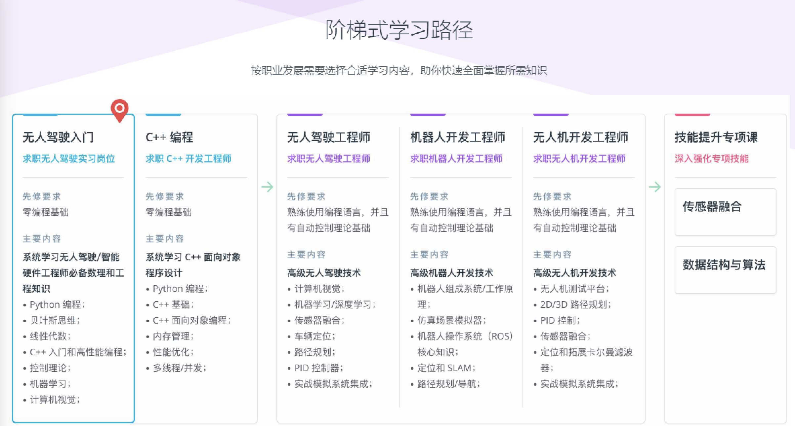

# 自动驾驶
This project for self-driving cars learning
本项目主要用于在自我学习和研究自动驾驶技术中，收集各种学习资源。其中部分资源来源相关的个人，也会注明出处。

### The Roadmap of Learning Self Driving Cars (自动驾驶学习路线)
> The image[1] shows the roadmap of becoming a self-driving cars engineer.

#### 如何成为一名自动驾驶工程师
[So you want to be a self-driving car engineer?](https://autonomous-driving.org/2018/08/15/so-you-want-to-be-a-self-driving-car-engineer/)[2].

### Table of Content(资源目录)
- [Companies （自动驾驶公司）](#companies)
- [Websites(学习网站)](#websites)
- [Blogs, News and Articles (博客文章)](#blogs)
- [Technical Skills (技术学习)](#skills)
- Books 书籍
- Papers 论文
- [Reports（行业报告）](#reports)
- Magazines 杂志
- Notes 笔记
- Courses 课程
- Videos 视屏
- Project 项目
- Challenges 竞赛
- Codes 代码
- Jobs 岗位
- Platforms 论坛
- Future 前沿
- [References（参考文献）](#refers)

### Companies (自动驾驶公司) 
- [Waymo](https://waymo.com/intl/es/)
- [Tesla](https://www.tesla.com/de_DE/autopilot)
- 

### Websites (学习网站)

#### 1，[Udacity](https://www.udacity.com/)
The School of Autonomous Systems 
> The field of autonomous vehicles is set to grow by 42% within the next four years, with salaries for top engineers averaging between $300-$500k. Advance your career in this rewarding field by studying 15 hours/week.

**Programs**
- Introduction to Self-Driving Cars
- Robotics Software Engineer
- C++
- Flying Car and Autonomous Flight Engineer
- Self-Driving Car Engineer
- Sensor Fusion Engineer
- Digital Freelancer(数字的自由职业者)

#### 2, [Coursera](https://www.coursera.org/)
Self-Driving Cars Specialization Offered by University of TORONTO
> Launch Your Career in Self-Driving Cars. Be at the forefront of the autonomous driving industry.

**Courses**
- Introduction to Self-Driving Cars
- State Estimation and Localization for Self-Driving Cars
- Visual Perception for Self-Driving Cars
- Motion Planning for Self-Driving Cars

#### 3, [中国大学 MOOC](https://www.icourse163.org/course/BIT-1207432808?tid=1465692443)
> 这是一门面向初学者的无人驾驶车辆慕课，由北京理工大学智能车辆团队倾情打造。理论联系实际，用丰富的案例进行讲解。课程也许不会告诉你无人驾驶全部的“秘密”，但从这门课学到的知识，可以帮助你去探寻无人驾驶的“秘密”。
>来吧，这里有你想要的 ^_^

### Blogs, Articles and News (博客文章) 
- blogs,[How cities can benefit from automated driving (城市如何从自动驾驶中受益)](https://www.bosch.com/stories/economic-impact-of-self-driving-cars/)
- blogs,[How Google's Self-Driving Car Will Change Everything (谷歌的自动驾驶汽车将如何改变一切)](https://www.investopedia.com/articles/investing/052014/how-googles-selfdriving-car-will-change-everything.asp)
- news, [Introducing the 5th-generation Waymo Driver: Informed by experience, designed for scale, engineered to tackle more environments (引入第 5 代 Waymo 驱动程序：以经验为基础，为规模而设计，旨在应对更多环境)](https://blog.waymo.com/2020/03/introducing-5th-generation-waymo-driver.html)

### Technical Skills (技术学习) 
- Machine Learning 机器学习
  - 混淆矩阵，[Understanding Confusion Matrix(理解混淆矩阵)](https://towardsdatascience.com/understanding-confusion-matrix-a9ad42dcfd62) 
  - 交叉验证，[Cross Validation(交叉验证)](https://www.cs.cmu.edu/~schneide/tut5/node42.html) 
- Deep Learning 深度学习 
  - 模型训练，[A Recipe for Training Neural Networks(训练神经网络的秘诀)](http://karpathy.github.io/2019/04/25/recipe/)   
- Computer Vision 计算机视觉
  - 图像形成，[Geometry of Image Formation(图像形成几何)](https://learnopencv.com/geometry-of-image-formation/) 
  - 图像校正，[Understanding Lens Distortion(了解镜头失真)](https://learnopencv.com/understanding-lens-distortion/)
- Object Detection 目标检测
  - 联合交集IoU, [Intersection over Union (IoU) for object detection(用于目标检测的联合交集 (IoU))](https://www.pyimagesearch.com/2016/11/07/intersection-over-union-iou-for-object-detection/)[3]

### Reports（行业报告）
**1，智能汽车产业链全景图**
- [智能汽车产业链全景图（2021年10月版）](https://mp.weixin.qq.com/s/-HccIKWX8kNafs3osAS9qA)
- [智能汽车产业链全景图（2021年9月版）](https://mp.weixin.qq.com/s/cBGwT6GC1kRWL_gSBFcNug)
- [智能汽车产业链全景图（2021年8月版）](https://mp.weixin.qq.com/s/VW3BGpLQFF2oWJh0L4dB7w)
- [智能汽车产业链全景图（2021年7月版）](https://mp.weixin.qq.com/s/9n2ufRSNdFqrYqaOMPGDeA)
- [智能汽车产业链全景图（2021年6月版）](https://mp.weixin.qq.com/s/Syj6O3cAzPLNJor1QglQWg)
- [智能汽车产业链全景图（2021年5月版）](https://mp.weixin.qq.com/s?__biz=MzA4NTcwMDQwMg==&mid=2650795086&idx=1&sn=3a9e0128602301ba0f8d0e5f30225a28&chksm=87d8b613b0af3f057ba6f0142101a1e3f5782e942b18b7eb8a0ce6a2d36d8068791304cc0fc9&scene=178&cur_album_id=1673026835321831424#rd)
- [智能网联汽车产业链全景图（2021年4月版）](https://mp.weixin.qq.com/s/_-WEZrf_th5rtAqcq5YaAA)
- [智能网联汽车产业链全景图（2021年3月版）](https://mp.weixin.qq.com/s/zngNt1EVvu1x0glEFD5VoA)
- [智能网联汽车产业链全景图（2021年1月版）](https://mp.weixin.qq.com/s/MUus8eW-Y2LFj8PwodZmwg)
- [智能网联汽车产业链全景图（2020年12月版）](https://mp.weixin.qq.com/s/twt6K6tBfs_q_7HO5wKf_g)
- [智能网联汽车产业链全景图（2020年11月版）](https://mp.weixin.qq.com/s/3fNS-JiOfF-HcTuiaP-Yjw)
- [智能网联汽车产业链全景图（2020年10月版）](https://mp.weixin.qq.com/s/oTjp4uCSzYI8qcezaWKKfw)
- [智能网联汽车产业链全景图（2020年9月版）](https://mp.weixin.qq.com/s/ND4SbkDxZCLgb6Xt1bvaHw)
- [智能网联汽车产业链全景图（2020年8月版）](https://mp.weixin.qq.com/s/mUS5oDGyPFbug9hoPg-Ubw)
- [座舱产业链全景图（2020年8月版）](https://mp.weixin.qq.com/s/5zqEhNDEPpEQVM6OxUmtJw)
- [智能网联汽车产业链全景图（2020年7月版）](https://mp.weixin.qq.com/s/30OQjOJTPvHnfpralzvVrA)
- [智能网联汽车产业链全景图（2020年6月版）](https://mp.weixin.qq.com/s/grEUnaEhBl4WqCYBlU1tpQ)
- [2019年自动驾驶产业链企业全景图（共300多家）](https://mp.weixin.qq.com/s/Su8LaHFucmi2BUkq1fcjPg)

### References 
- [1] Udacity https://www.udacity.com/
- [2] Felix, 2018, So you want to be a self-driving car engineer? 
- [3] Adrian Rosebrock, 2016, Intersection over Union (IoU) for object detection
