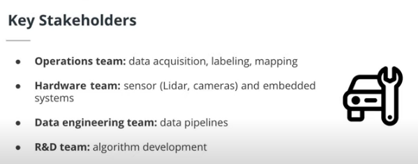
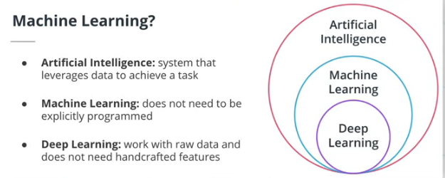
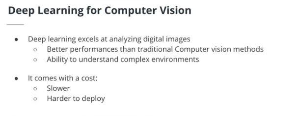
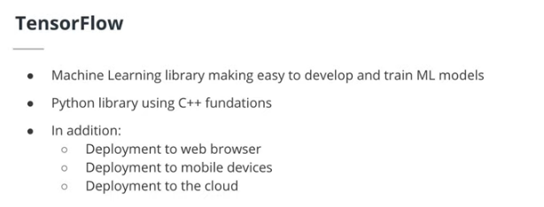
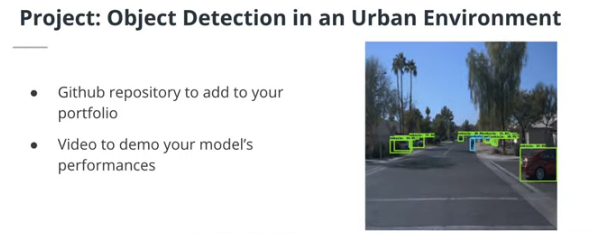
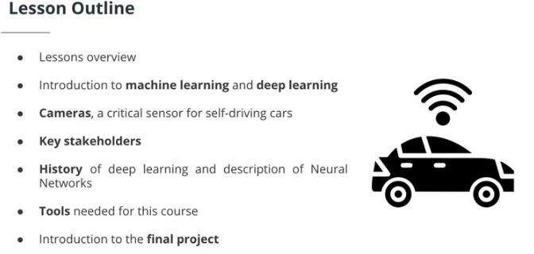
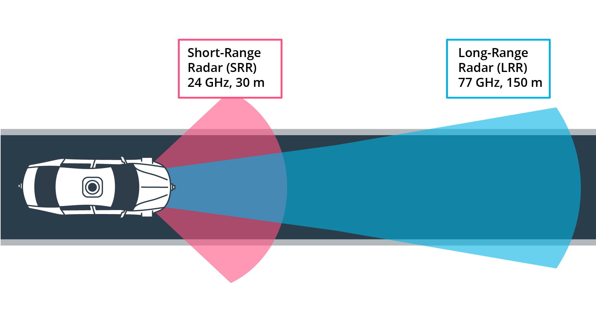

## Udacity for Self Driving Cars Engineer
@(Udacity, Self Driving Car Engineer Nano-degree Program) 自动驾驶工程师
begin date:  01/11/2021 end date: 31/12/2021

[TOC]

### 1. Welcome to Self Driving Car Engineer Nano-degree
#### Lesson 1: An Introduction to your nano-degree program
- Welcome to Udacity
- The Udacity Experience
- How to Succeed
	-  Golas
		-  Define learning path
		-  Define goals
		-  Goal could be to learn more
		-  Keep goals in mind
		-  Set short and long term goals
		-  Create incremental plan
	-  Accountability
		-  Build in accountability to meet the goal
		-  Make learning a habit
		-  Remember your larger goal
		-  Build rewards for your learning habit
	- Learning Strategies 
		- Break code logic into pseudocode
		- Be patient with yourself
		- Remember your goals
	- Technical advice
		- Coding requires debugging
		-  Seek solutions
		-  Look at successful examples
		-  Build code incrementally
	- Summary
		-   Set goals and accountability measures
		-  Break down goals into smaller goals
		-  Focus on smaller goals
		-  Work through exercises
		-  Pseudocode first, code last

#### Lesson 2: Getting help
What it Takes
> Completing a Udacity program takes perseverance and dedication, but the rewards outweigh the challenges. Throughout your program, you will develop and demonstrate specific skills that will serve you for a lifetime. Congratulations on taking the first step towards developing the skills you need to power your career through tech education!

> The videos, text lessons, and quizzes you encounter in the classroom are optional but recommended. The project at the end of this course will test your ability to apply the skills and strategies you have learned in the classroom to real-world problems. It will also provide tangible outputs you can use to demonstrate your skills for current and future employers.

> The project is designed to be challenging. Many students initially struggle, but with a little grit, they are able to learn from their mistakes and build their skills. Data from nearly 100,000 Udacity graduates show that commitment and persistence are the highest predictors of whether or not a student will graduate.

> At some point, nearly every student will get stuck on a new concept or skill, and doubt may set in. Don’t panic. Don’t quit. Be patient, and work through the problem. Remember that you are not alone and the problem that you are encountering is likely one that many others have experienced as well. Whether you are stuck or simply looking for encouragement, you’ll find Udacity Mentors and students there to help.

> 完成一个大胆计划需要毅力和奉献精神，但回报大于挑战。在整个计划中，您将培养和展示为您服务一生的具体技能。祝贺您迈出第一步，通过技术教育发展您的事业所需的技能！

> 您在课堂上遇到的视频、课文课程和测验是可选的，但建议使用。本课程结束时的项目将测试您将课堂中学到的技能和策略应用于实际问题的能力。它还将提供有形的产出，您可以使用这些产出来为当前和未来的雇主展示您的技能。

> 该项目的设计具有挑战性。许多学生最初都在挣扎，但稍有勇气，他们就能从错误中吸取教训，并培养自己的技能。来自近10万名Udacity毕业生的数据显示，承诺和坚持是学生能否毕业的最高预测因素。

> 在某些时候，几乎每个学生都会陷入一个新的概念或技能，怀疑可能会开始。不要惊慌。不要放弃。要有耐心，并努力解决这个问题。请记住，你并不孤单，你遇到的问题很可能是其他许多人也经历过的问题。无论你是被卡住还是只是寻求鼓励，你都会在那里找到大胆的导师和学生来帮忙。

Getting Help
- Technical Mentor Help
- Udacity Support Community
- General Account Help

#### Lesson 3:  认识 Waymo
- [Waymo](https://waymo.com/) 公司
- Dragomir Anguelov 
- [Waymo 开放数据集](https://waymo.com/open/)
- What is Waymo?
- Wayno 在哪测试车辆？
- The Waymo 开放数据集
	- 截至 2021 年 3 月，数据集有两个不同的部分：感知数据和运动数据。我们将在前两门课程中使用感知数据，但不会在课程中使用运动数据，因为它是在相关课程投入生产后发布的。
- Waymo 开放数据集挑战赛
- Waymo 开放数据集中的对象
	- 车辆，行人
- 为什么 Waymo 开放数据集中省略了雷达？
- 自动驾驶汽车最重要的技术
	- 监督学习，深度学习
	- GANs
- 验证 Waymo 驱动程序
	- https://blog.waymo.com/2020/10/revealing-our-approach-to-safety.html
- 自动驾驶汽车的预测
- 为什么在 Waymo 工作?
	- Roboticists
	- computer scientists
	- deep-learning researchers
	- hardware experts and so on.
- Waymo 正在招聘什么职位
- 什么是好的候选人
- Waymonauts 获得纳米学位
- 为什么要攻读纳米学位
	- 计算机视觉、传感器融合等主题的信息。 

### 2. Computer Vision
#### Lesson 1: Introduction to Deep Learning for Computer Vision
- **导师，Thomas Hossler**
- **先决条件**
	- 使用Python编写面向对象的代码并熟练使用numpy和matplotlib库（例如用于矩阵乘法和简单绘图）
	- 计算常用函数的导数（基本微积分技能），例如$x^2, \frac{1}{x}$
	- ​计算矩阵和点积的乘法（基本线性代数技能）
- **Lesson Outline 课程大纲**
	- 课程总纲
	- 自动驾驶汽车 (SDC) 背景下的计算机视觉介绍
	- 为什么我们需要SDC 中的摄像头？
	- 从经典计算机视觉到深度学习
	- SDC中物体检测的挑战
	- 课程工具和环境
	- 最终课程项目
- **课程大纲**
	- 计算机视觉深度学习简介（本课）
	- 机器学习工作流概述
	- 线性和逻辑回归：神经网络简介
	- 使用卷积神经网络对图像进行分类
	- 检测图像中的对象
	- 最终项目
- **Key Stakeholders**
- > Self-driving cars or autonomous vehicles will have a huge impact on our society once the technology is deployed at scale. The following articles highlight the economic impact as well as the broader consequences of the technology.
	- Impacts on society
		- Improving commute experience
		- Reducing traffic
		- Reducing number of accidents
		- Changing cities layouts
		- Reducing air pollution
	- [economic impact](https://www.bosch.com/stories/economic-impact-of-self-driving-cars/) 
	- [broader consequences](https://www.investopedia.com/articles/investing/052014/how-googles-selfdriving-car-will-change-everything.asp)
	- insurance companies
	- city planners
	- lawmakers
	- daily drivers
	- 
 - **Introduction to Deep Learning and Computer Vision**
	 - 
		- Artificial Intelligence (AI): a system that leverages information from its environment to make decisions. For example, a video game bot.
		- Machine Learning (ML): an AI that does not need to be explicitly programmed, and instead learns from data. For example, a spam classification algorithm.
		- Deep Learning (DL): a subset of ML algorithms that do not require handcrafted features and can work with raw data. For example, an object detection algorithm with a convolutional neural network.
		- Supervised Learning
		- In this course, we will focus on supervised learning, where we use annotated data to train an algorithm. In supervised learning, we will define the following:
	> Input variable / XX / Observation: the input data to the algorithm. For example, in spam classification, it would be an email.
	> Ground truth / YY / label: the known associated label with the input data. For example, a human created label describing the email as a spam or not.
	> Output variable / \hat{Y}  Y^/ prediction: the model prediction given the input data. For example, the model predicts the input as being spam.

- Why CV Is import for SDC
	- computer vision for self driving cars
	- Self-driving cars have multiple sensors, such as cameras, radar or lidar. In this course, we will focus on the camera sensor. Using this sensor, the system will be able to perform multiple tasks critical to its autonomy, such as detecting pedestrian, lanes or traffic signs. Later in the Nanodegree, you will perform sensor fusion using camera and lidar data!
	- 自动驾驶汽车有多个传感器，例如摄像头、雷达或激光雷达。在本课程中，我们将重点介绍**相机传感器**。使用该传感器，系统将能够执行对其自主性至关重要的多项任务，例如检测行人、车道或交通标志。稍后在纳米学位中，您将使用相机和激光雷达数据执行**传感器融合**！
- When to Use Deep Learning for Computer Vision
	- 
	> Deep Learning algorithms are now the state of the art (SOTA) in most computer vision problems, such as image classification or object detection. Therefore, they are now in every SDC system. However, using deep learning adds additional constraints to the system because they require more computational power. 

- **History of Deep Learning**
	- Artificial neural networks (ANN) 
	- Artificial neural networks (ANN) or simply neural networks are the type of systems at the core of deep learning algorithms.  **ANN**: machine learning algorithms vaguely based on human neural networks. **Neurons**: the basic unit of neural networks. Takes an input signal and is activated or not based on the input value and the neuron's weights. **Layer**: structure containing multiple neurons. Layers are stacked to create a neural network.

- **TensorFlow**
	- 
	- In this course, we will be using the [TensorFlow](https://www.tensorflow.org/) library to create our machine learning models. TensorFlow is one of the most popular ML libraries and is used by many companies to develop and train algorithms. TensorFlow makes it very easy for the user to deploy such algorithms on different platforms, from a smartphone device to the cloud.

- **Register for the Waymo Open Dataset**
注册Waymo 开放数据集
- **Tools, Environment & Dependencies**
	- 
	- 
In this course, you will need the following:
> Install gsutil: a Python application to manipulate Google Cloud Storage items. You will find the tutorial to install it here. Create a Github account: a version control system. You will need to create an account here. You will need a github account to access some of the material and create your submission for the final project. If you already have an account, you are good to go for this step! Set up an Integrated development environment (IDE): a software application to write code. For this course, I would recommend either Pycharm or VS Code.

- Project : Object Detection in an Urban Environment
	- 
	- 
	- For the final project of this course, you will have to train an object detection model using the TensorFlow Object Detection API. This API simplifies the training and development of object detection models in TensorFlow. You will learn how to master it in this project. This API makes the exploration of the optimal parameters for your model extremely easy by using config files. Because you should try to create the best possible model, you will have to tweak and test different parameters. Finally, you will have to perform an in-depth error analysis.
	- 对于本课程的最终项目，您必须使用TensorFlow 对象检测 API训练对象检测模型。该 API 简化了 TensorFlow 中对象检测模型的训练和开发。您将在这个项目中学习如何掌握它。通过使用配置文件，此 API 可以非常轻松地探索模型的最佳参数。因为您应该尝试创建最好的模型，所以您必须调整和测试不同的参数。最后，您将必须执行深入的错误分析
	- 
- Recap 回顾

- In this lesson, we focused on the following:
	- Overall course outline: overview of the different lessons of this course.
	- Cameras and Computer Vision in SDC: we learned why the camera sensor is critical to SDC systems, and its strength and weaknesses.
	- From classic computer vision to Deep Learning: we learned about the history of deep learning and discovered the different components of a neural network.
	- Tools and Environment for the Course: we listed the different tools and software we will be using in this course.
	- Final Course Project: we listed the different aspects of the final project.

#### Lesson 2: The Machine Learning Workflow
#### Lesson 3: Sensor and Camera Calibration
#### Lesson 4: From Linear Regression to Feedforward Neural Networks
#### Lesson 5: Image Classification with CNNs
#### Lesson 6: Object Detection in Images
#### Project: Object Detection in an Urban Environment
> Use the Waymo dataset to detect objects in an urban environment.

### 3. Sensor Fusion
#### Lesson 1: Introduction to Sensor Fusion and Perception
- Introduction
> Welcome to this lesson on LiDAR technology. Without LiDAR sensors, we will most probably not see fully self-driving cars become a reality.
> 
> In the first chapter, we will start with the general role of LiDAR in autonomous driving first. You will learn about the various levels of autonomous driving, get a brief introduction to camera, LiDAR and radar and we will discuss criteria you need to consider for sensor selection.
> 
> In the second chapter, we will look at the LiDAR sensors used in Waymo vehicles. We will briefly look into the most important technical specifications, discuss the structure of the Waymo Open Dataset and I will introduce you to the course starter code for many of the exercises.
> 
> In the third chapter, you will focus on LiDAR technology. You will learn about the LiDAR working principle, the LiDAR equation and the meaning of multiple signal returns. Also, you will get an overview of currently available LiDAR types and the major differences between them.
> 
> We will also look at the concept of range images used in the Waymo dataset. You will learn how range images are structured and how you can transform them into 3d point-clouds.

- The Role of Lidar in Autonomous Driving
	- 激光雷达在自动驾驶中的作用
	- 自动驾驶工程师协会 (SAE) 定义的“自动驾驶级别”。
	- 
	- 驾驶员辅助系统 (ADAS)（例如前方碰撞警告和制动或自适应巡航控制）是唯一可在某些驾驶情况下（安全或舒适）至少使单个车辆功能自动化的系统。
	- 3 级系统的商用车辆
	> - 此类系统必须足够可靠，才能最大限度地减少错误决策。工程师通常通过在汽车上添加大量传感器来解决这个问题，这使得此类系统（非常）昂贵。
	> - 对事故引起的诉讼的恐惧导致有意降低系统的可用性，例如通过限制驾驶速度或场景（例如，仅在高速公路上以低于 60kph 的速度行驶且车道标记清晰可见的情况下）。
	> - 无法保证驾驶员随时准备好控制车辆。由于人类的反应时间和警觉水平，在许多情况下这是不可能的。
	
 - Autonomous Vehicle Sensor Types 自动驾驶传感器类型
 - 
- 相机
	- >摄像头已经在许多汽车上司空见惯，并用于各种目的，例如**车辆和行人检测、车道检测、道路标志识别或简单地向驾驶员展示后方区域的视图**。相机属于被动传感器组，这意味着它们获取从物体反射的环境光并将其转换为二维图像。
	- >自动驾驶汽车广泛依赖摄像头来执行许多各种功能，这远远超出了障碍物检测（例如高精度地图绘制和定位）。
	- > 然而，在交通中存在许多情况，其中从物体反射的光不足以进行稳定检测（例如在夜间光线不足的地区、大雨中、阳光直射）。在这种情况下，需要不依赖于环境条件的其他类型的传感器。

- 雷达
	- 与摄像头一样，当今许多车辆已经配备了一个或多个雷达传感器。这种传感器类型最常用于驾驶员辅助系统，例如“自适应巡航控制”或“自动紧急制动”。
	- 雷达是有源传感器，因为它们发出电磁波，该电磁波被具有某些特性的物体（例如金属）反射。根据信号的运行时间，雷达传感器可以非常准确地估计距离。此外，基于称为“多普勒效应”的物理原理，雷达可以通过评估与物体速度成正比的返回信号中的频移来测量移动物体的速度。
	- 雷达传感器的主要优势之一是它们能够在几乎所有天气条件下可靠工作。然而，雷达的空间分辨率非常低，这就是为什么它们不适合非常准确地测量物体的尺寸。此外，金属含量很少或不含金属的物体（例如行人）不会产生强烈的回波信号，并且很难与背景噪声分开。
	- 汽车雷达传感器通常在两个频段之一工作：24GHz 雷达传感器用于短距离应用并具有更宽的张角，而 77GHz 传感器用于窄锥体中的远程感应。
	- 
- 激光雷达（LiDAR）
	- LiDAR 也属于主动传感器组。基本原理基于发射激光束并测量光从物体反射回来并返回传感器所需的时间。目前在自动驾驶汽车中使用的最突出的 LiDAR 类型是安装在车顶的顶部设备，以 360 度弧形快速旋转，每秒生成数千个测量值。
	- 这种旋转的 LiDAR 传感器可以创建非常精确的周围环境 3D 点图，因此可以检测车辆、行人、骑自行车者和其他障碍物。这种传感器类型也称为扫描 LiDAR，因为它需要移动其部件以逐步对视场进行光栅化（“扫描”）。
	- 然而，当前可用的传感器类型有一个明显的缺点：它们通常要花费数千美元，具体取决于型号和功能。尽管工程师们努力降低成本，但 LiDAR 仍然是自动驾驶汽车中最昂贵（也是最笨重）的传感器。

- 目前，LiDAR 行业正在研究三个核心问题：
	- 降低单位价格
	- 减小包装尺寸
	- 增加感应范围和分辨率

作为扫描 LiDAR 的替代方案，还有非扫描传感器，也称为Flash LiDAR。术语“闪光”指的是视场完全由激光源照亮，就像带有闪光灯的相机一样，而光电探测器阵列同时接收反射的激光脉冲。

Flash LiDAR 传感器没有任何移动部件，这就是为什么它们抗振动并且封装尺寸比扫描 LiDAR 传感器小得多。与屋顶安装的 LiDAR 类型相比，这种传感器类型的缺点是范围有限且视野相对较窄。在自动驾驶汽车中，扫描和非扫描 LiDAR 都用于观察车辆周围的不同区域：安装在车顶的扫描 LiDAR 可生成 360 度视图，直到大约 80-100m 而非扫描 LiDAR 传感器（通常安装在四个角落）在顶部安装的传感器盲区观察车辆的直接附近。

**其他传感器类型**
除了摄像头、雷达和 LiDAR，还有其他类型的传感器可用，例如超声波传感器（自 1990 年代以来广泛用于停车应用）或立体摄像头（有时也称为伪 LiDAR）。但是，这些传感器超出了本课程的范围。从传感器融合的角度来看，将摄像头传感器与 LiDAR 或雷达或两者结合使用是最有意义的，以获得可靠且准确的车辆周围环境重建。

#### Lesson 2:  The Lidar Sensor

#### Lesson 3:  Detecting Objects in Lidar

#### Mid-term Project: 3D Object Detection

### 4. Localization

### 5. Planning

### Glossary (术语表)

- **Artificial Intelligence (AI)**: a system that leverages information from its environment to make decision. For example, a video game bot. 人工智能 (AI)： 一种利用来自其环境的信息来做出决策的系统。例如，视频游戏机器人。
- **Artificial Neural Networks (ANN)**: machine learning algorithm vaguely based on human neural networks. 人工神经网络（ANN）：模糊地基于人类神经网络的机器学习算法。
- **Deep Learning (DL)**: a subset of ML algorithms that do not require handcrafted features and can work with raw data. For example, an object detection algorithm with a convolutional neural network. 深度学习 (DL)： ML 算法的一个子集，不需要手工制作的特征并且可以处理原始数据。例如，带有卷积神经网络的物体检测算法。
- **Layer**: structure containing multiple neurons. Layers are stacked to create neural networks. 层：包含多个神经元的结构。层被堆叠以创建神经网络。
- **Machine Learning (ML)**: an AI that does not need to be explicitly programmed and instead learns from data. For example, a spam classification algorithm. 机器学习 (ML)：一种不需要明确编程而是从数据中学习的 AI。例如，垃圾邮件分类算法。
- **Neurons**: the basic unit of ANNs. Takes an input signal and is activated or not based on the input value and the neuron's weights. 神经元：人工神经网络的基本单位。接受输入信号并根据输入值和神经元的权重激活或不激活。
- **TensorFlow**: ML library using a Python interface. Extremely useful to develop, train and deploy ML algorithms on multiple platforms. TensorFlow：使用 Python 接口的机器学习库。对于在多个平台上开发、训练和部署 ML 算法非常有用。
- **TensorFlow Object Detection API**: This API simplifies the training and development of object detection models in TensorFlow. TensorFlow 对象检测 API：该 API 简化了 TensorFlow 中对象检测模型的训练和开发。