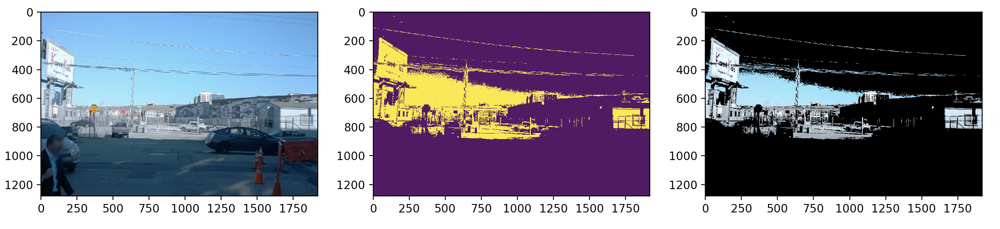
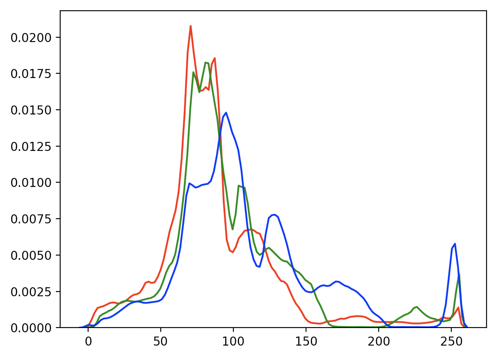

# Exercise 2 

## Part 1 - Masking

### Objective

The goal of this exercise is to make you familiar with color thresholding. We will be using the RGB color model. In particular, your goal is to isolate all the pixels of a RGB image equal / higher / lower to a given color and a create a binary mask. You will use this mask to create a masked version of the RGB image.

In the example below, we can see (from left to right), the original RGB image, the binary mask and the masked RGB image. In this example, we used a RGB color threshold of `(128, 128, 128)` and isolated all the pixels with a RGB value higher than this threshold.



### Details

You need to implement two functions in `masking.py`. 

The `create_mask` function outputs a binary mask given an input RGB image. This mask has the same
spatial dimensions as the input image. You need to perform an element-wise comparison 
as shown in the pseudo-code below:

```
mask[x, y] = 0 if image[x, y, :] <= color else mask[x, y] = 1
```

The `mask_and_display` function uses the image array as well as the mask array and displays next to each
other the original image, the binary mask and the masked image.

### Running the Code

**Note:** Any visualized code will only pop up through the workspace desktop - if you complete work in the primary workspace window, you'll need to click the "Desktop" button in the bottom right to view visualizations.

Run `python masking.py` to check your results.

### Tips

You can use numpy element-wise multiplication to mask the RGB image.


## Part 2 - Statistics 

### Objective

In this exercise, you first need to calculate the channel wise mean and standard deviations of a list 
of images in `statistics.py`. Then you need to display the pixel value distributions per channel, as shown in the 
figure below, for example.



### Details

The `calculate_mean_std` function outputs the channel wise mean and standard deviation over a list in images. This function outputs two `1x3` numpy array, one for the mean and one for the standard deviation.

The `channel_histogram` function creates the channel wise histograms. You should encode each distribution with the same color channel as shown in the example above.

### Running the Code

**Note:** Any visualized code will only pop up through the workspace desktop - if you complete work in the primary workspace window, you'll need to click the "Desktop" button in the bottom right to view visualizations. The `channel_histogram` function, as implemented in the solution, may take a substantial amount of time to display in the workspace (a minute or more).

Run `python statistics.py` to see the results of your code. 

### Tips

You can use the `ImageStat` module of Pillow to calculate image statistics. Feel free to experiment with other Python visualization libraries such as [Seaborn](https://seaborn.pydata.org/) (which is installed in the workspace).
