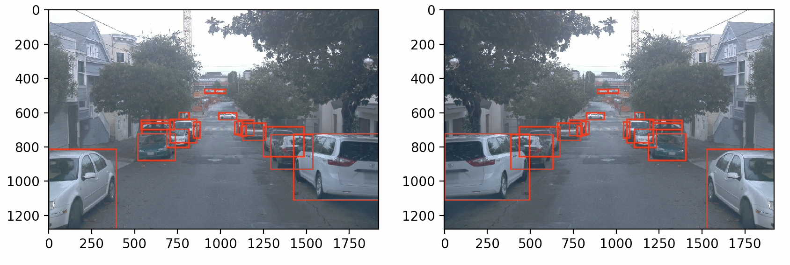
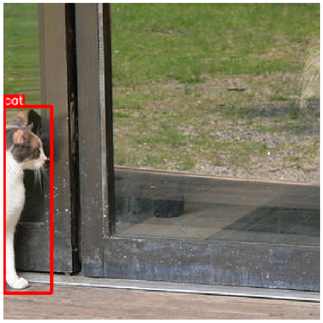

# Exercise 3 - Geometric transformations

## Objective

In this exercise, you will implement the following geometric transformations
from scratch: horizontal flipping and resizing in `augmentations.py`. You can also 
implement random cropping as an additional but not required exercise. Your 
implementations should not only affect the images but also the associated bounding boxes. 

## Details

The `hflip` function takes the image and bounding boxes as input and performs a 
horizontal flip. For example, an object initially on the left of the image will 
end up on the right.

The `resize` function takes the image, bounding boxes and target size as input. 
It scales up or down images and bounding boxes.

The `random_crop` function takes a few additional inputs. It also needs the classes, 
the crop size and the minimum area. Let's explain these parameters:
* `crop_size` is the size of the crop. It should be smaller than the dimensions of the input image.
* `min_area` is the minimum area of a bounding boxes to be considered as an object after cropping.

Because we are cropping randomly, we may only keep a tiny portion of an object, in which
case the annotations will not be useful anymore. For example, in the image below, we may not want to keep the annotation of the cat because most of the animal's body is not visible.

**Note:** You'll need to use the "Desktop" button to view the visualizations of each augmentation.

## Tips

The `hflip` transform does not affect the x coordinates of the bounding boxes.

You will use the same ratio in `resize` for the image and the bounding boxes. 

To find which bounding box belongs to the cropped area, you can use the `calculate_iou`
function.
